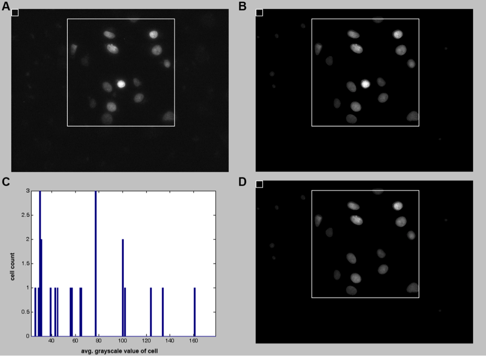
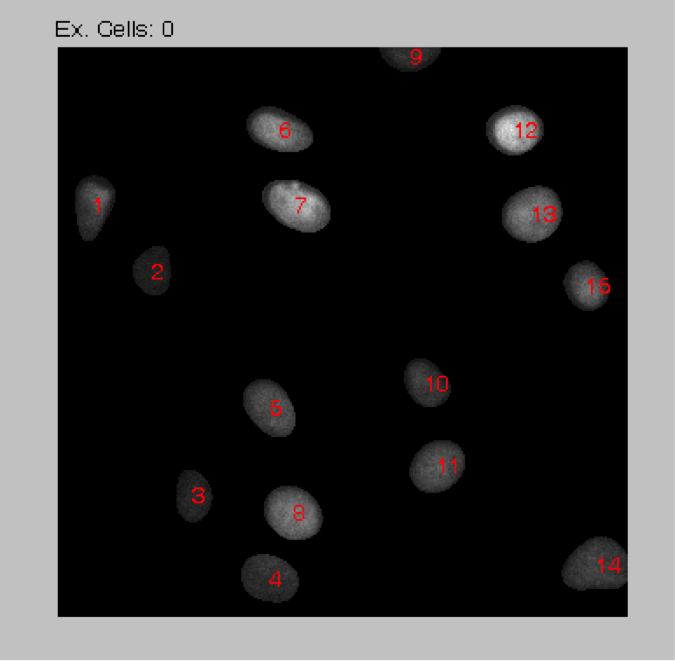

# Cell Counter
The **Cell Counter** program detects the number of cells and quantifies the average fluorescence intensity per cell in HeLa cells after immunocytochemistry staining of thymine dimers with Alexa 488. Images for analysis were collected by epifluorescence imaging with a CCD camera. The program selects for bright regions above the background (damaged cell nuclei). The program then quantifies the fluorescence intensity in each cell, excludes any bright regions (due to non-specific fluorophore clumping), averages the total fluorescent intensity of all the cells, and counts the number of cells present. However, it can be adapted to use the quantify the average intensity of bright, roughly spherical regions in an image. It is written in Matlab and is compatable with at least Matlab 2010 and later. 

#### Reference
This code was used to analyze data for this publication. https://doi.org/10.1016/j.bpj.2011.09.031

## How to use the script
### Input
The script contains several adjustable parameters. The name of the image is set by the name string. 
```
name='example.png';
```
The region of the image that contains damaged cells is selected by adjusting the variables `x` and `y` which correspond to the coordinates of the upper left corner of the bounding box shown in Matlab output Figure 1 (Fig. 1A). The length of the bounding box is set by the `xsize` and `ysize` parameters. 
```
%box 
x = 70;
y = 25;
xsize = 290;
ysize = 295; 
```
Also in Fig. 1 is a small box that is used the set the background fluorescence. By default it is in the upper left hand corner and set to be 20x20 pixels. The location can be adjusted by `xbkg` and `ybkg`.
```
xbkg = 1;
ybkg = 1; 
```
Adjusting the variables `av1`, `av2`, and `thresh` determine the thresholding requirements to determine damaged cell nuclei.  The mask is shown in Matlab output Figure 2 (Fig. 1B). The minimum area for a cell is set by `cellsize` and the number of cells meeting this criterion are output in `cells_threshold`.   
```
av1=1; %width of the narrow gaussian
av2=20; %width of the wide gaussian
thresh=1.8; %difference between the gaussians for detection 
cellsize = 150; %the minimum size of the cell 
```
### Output
The output variable `meanpix1_bkgcorr` gives the average intensity of the cells in Figure 2 after subtracting the background intensity. Output Figure 4 (Fig. 1D) is the same mask as Figure 2 except any cell with an average intensity greater than cutoff has been excluded from the analysis. The output variable `meanpix2_bkgcorr` gives the average intensity of the cells in Figure 4 after subtracting the background intensity.  Finally, output Figure 5 (Fig. 2) counts the number of cells in the region of interest. 

### Output Figures 


Fig. 1:  Figures generated by the program. These figures are used to adjust parameters of the program to ensure that the cell region is properly bound and any non-specific, bright staining regions are excluded. (A) Figure 1 output from the MatLab program. This figure shows the original image with the bounding boxes for the cells that are to be quantified (large box) and the fluorescence background for background subtraction (small box in upper left hand corner). (B) Figure 2 output from the Matlab program. This figure shows the original image multiplied by a binary mask to only show the cell nuclei that meet the thresholding requirements. (C) Figure 3 output from the MatLab program. This figure is a histogram of the cellular intensities.  Bright outliers are isolated using this histogram.  For the purposes of this figure, the bright threshold is set to a grayscale value of 150. (D) Figure 4 output from the MatLab program.  The same data as in panel B except the cells with an average intensity above 150 grayscale value have been excluded. Note that the bright cell near the middle of the box in panel B is gone in this panel. 



Fig. 2: This figure identifies which cells were counted by the program.  Any cells that were exclude due to having too small of an area are listed at the top by number to the right of “Ex. Cells:”.
